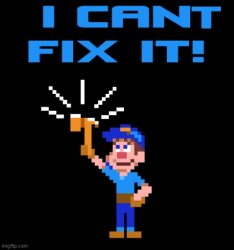

# APIs are contracts

An API is an interface to a domain.

It exposes meaningful capabilities—not just database operations—and makes the interaction clear to its consumers.

An API contract should explain:

- What does this operation mean?
- What information is required?
- Who is allowed to invoke it?
- What is each caller allowed to do?
- What happens when it succeeds?
- What happens when it fails?
- What side effects should the client expect?
- What can the client safely do next?

Humans can fill in gaps with context and conversation.

Machines need those gaps closed by the contract.

**Question:** How can we turn the ambiguous appointment request into a durable contract?

---

**Live demo:** Make the first improvement to the API.

